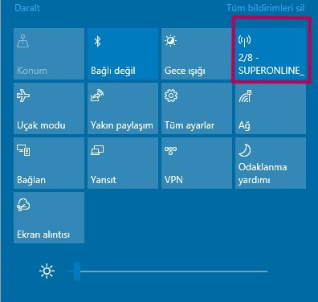
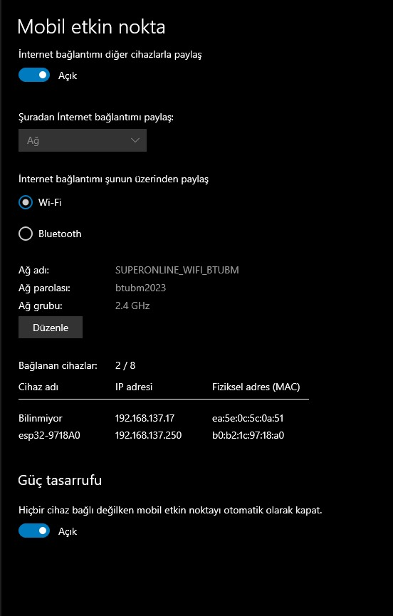
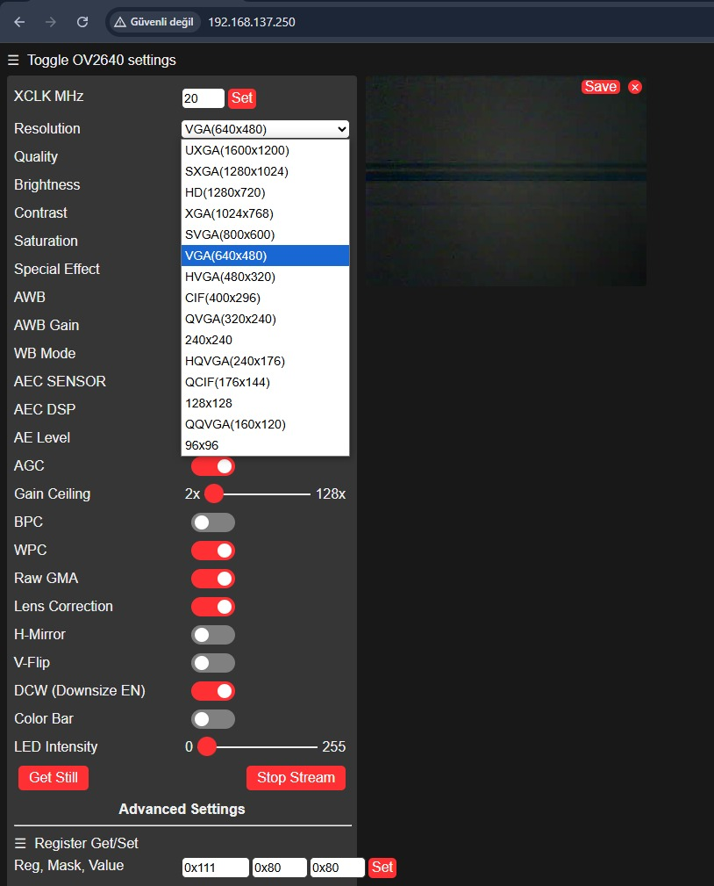
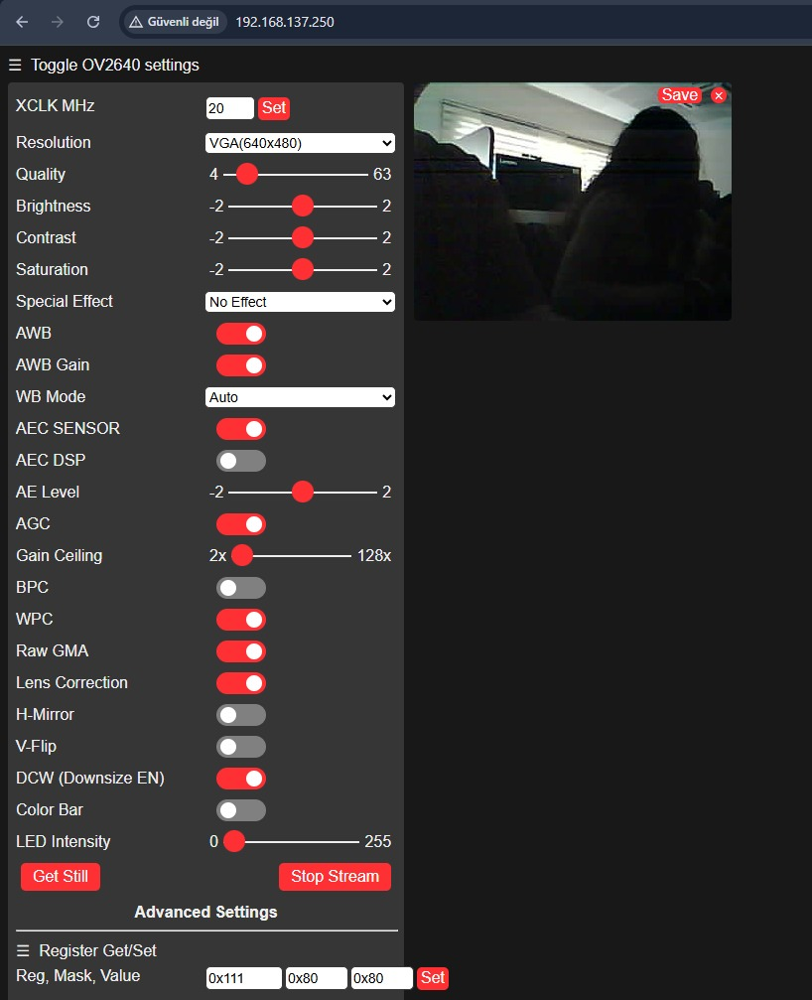
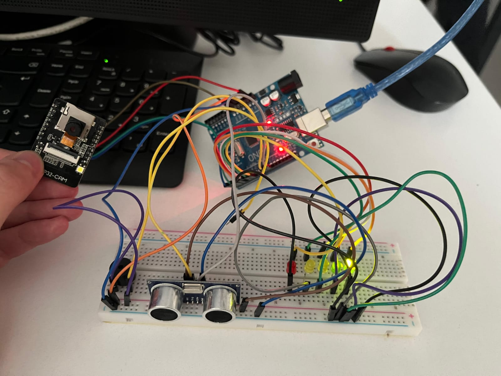
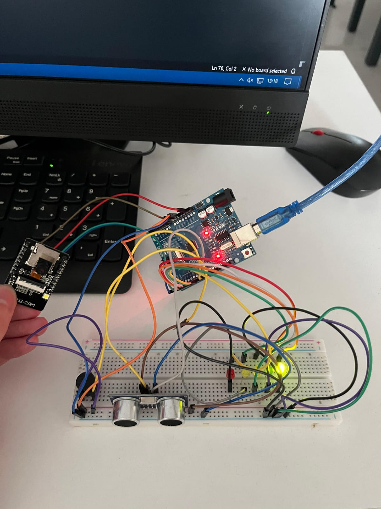
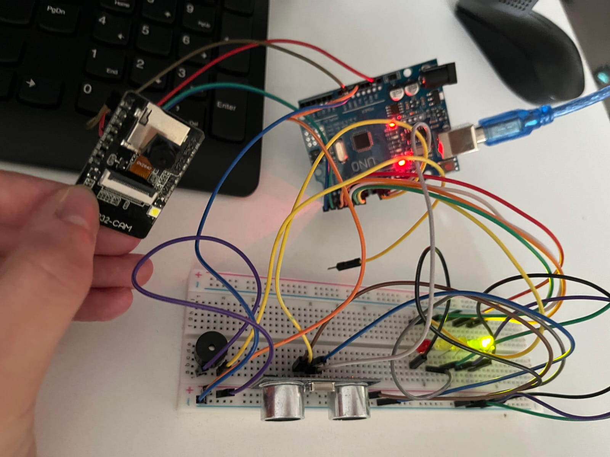

# 📌 Akıllı Park Sensörü Sistemi - Final Raporu


## 1. Proje Konusu

Bu proje, araçların park ve manevra süreçlerinde sürücülere yardımcı olmak üzere geliştirilen düşük maliyetli, genişletilebilir ve modüler bir akıllı park sensörü sistemidir. Sistem iki ana bileşene dayanmaktadır:

1. **Mesafe Algılama ve Uyarı Modülü** – Arduino UNO ile kontrol edilen HC-SR04 ultrasonik sensörü sayesinde aracın önündeki engellerle olan mesafe ölçülür. Elde edilen verilere göre LED’ler ile görsel uyarı, buzzer ile işitsel uyarı sunulur.
2. **Görüntü Alma ve Aktarım Modülü (ESP32-CAM)** – ESP32-CAM kullanılarak sistemin bulunduğu alanın görsel verisi yakalanır ve bir Wi-Fi ağı üzerinden kullanıcının cihazına canlı olarak aktarılır.

Bu sistem, park sırasında sürücülere yalnızca mesafe değil, aynı zamanda görsel bilgi de sağlayarak klasik park sensörlerinden daha gelişmiş bir destek sunmayı hedeflemektedir.

---

## 2. Özet

Projenin temel amacı, sürücüye çevresel farkındalık sağlamak üzere hem **sensör temelli ölçüm** hem de **kameralı izleme** sistemlerinin bir arada çalıştığı hibrit bir yapı kurmaktır. Bu doğrultuda;

- İlk etapta Arduino ile temel mesafe ölçüm ve uyarı sistemi oluşturulmuş,
- Ardından ESP32-CAM entegrasyonu ile görüntü alımı ve web tabanlı canlı yayın gerçekleştirilmiştir.
- Son olarak, tüm bileşenler aynı fiziksel sistem üzerinde test edilerek gerçek zamanlı çalışma sağlanmıştır.

Bu yapı sayesinde sürücüler, engellerin mesafesini LED ve buzzer uyarıları ile anlayabildiği gibi, sistemin bulunduğu çevreyi de cep telefonu, bilgisayar gibi cihazlardan canlı izleyebilmektedir.

---

## 3. Kullanılan Yöntemler ve Teknolojiler

| Bileşen / Yöntem | Açıklama |
|------------------|----------|
| **Arduino UNO** | Geliştirme kartı olarak kullanılmıştır. Tüm sensör okuma, LED kontrol ve buzzer yönetimi bu kart tarafından yapılmıştır. |
| **HC-SR04** | Ultrasonik mesafe sensörü. Trig ve Echo pinleri ile çalışır. Mesafe ölçüm algoritmasıyla cismin uzaklığı hesaplanır. |
| **LED & Buzzer** | Görsel ve işitsel uyarı birimleri. Kritik mesafe aralıklarında devreye girer. |
| **ESP32-CAM** | Görüntü yakalama ve Wi-Fi üzerinden canlı yayın aktarımı için kullanıldı. JPEG formatında sıkıştırılmış görüntüler bir web sunucusu üzerinden yayınlandı. |
| **Arduino IDE** | Hem Arduino hem de ESP32 için yazılım geliştirme ortamı olarak kullanıldı. |
| **ESP32 Tanımlama** | ESP32'nin Arduino IDE’de tanınması için gerekli kurulum dosyaları aşağıda listelenmiştir. |

### 🔗 ESP32 Arduino IDE Paket Linkleri

- `https://dl.espressif.com/dl/package_esp32_index.json`  
- `https://espressif.github.io/arduino-esp32/package_esp32_dev_index.json`

📺 **Referans Video:** [ESP32 programlama aşamasında kullanılan video](https://www.youtube.com/watch?v=OB6rJCxA42o)


---

## 4. Yapılan Çalışmalar

### 4.1 Donanım Tasarımı

- **Breadboard** üzerine devre kurulumu yapıldı.
- Ultrasonik sensör, LED’ler ve buzzer doğrudan Arduino UNO’ya bağlandı.
- ESP32-CAM modülü bağımsız çalışacak şekilde ikinci bir güç kaynağıyla beslenerek programlandı.

### 4.2 Arduino Kod Açıklaması

**Mesafe Algılama:**  
- `pulseIn()` fonksiyonu ile Echo pininden gelen yankı süresi ölçülür.
- Süre üzerinden mesafe hesaplanır (hız = 343 m/s, süre = 2x yol ⇒ yol = süre * 0.034 / 2).

**LED Kontrolü:**  
- 5 LED, mesafeye göre sırasıyla yanar:  
  <5 cm = 5 LED | <10 cm = 4 LED | … | <40 cm = 1 LED

**Buzzer Uyarısı:**  
- Mesafe <10 cm ise yüksek frekanslı ses,  
- 10–30 cm arası azalan tonlarda kısa süreli ses verir.

### 4.3 ESP32-CAM Entegrasyonu

- **ESP32-CAM modeli: AI-Thinker**
- Kamera pin tanımlamaları `camera_pins.h` üzerinden yapıldı.
- `camera_config_t` ile çözünürlük, JPEG kalitesi, PSRAM kontrolü sağlandı.
- Wi-Fi bağlantısı için:

```cpp
const char *ssid = "YOUR_WIFI_SSID";
const char *password = "YOUR_WIFI_PASSWORD";
```
## 🔌 ESP32-CAM Kurulum Aşaması

ESP32-CAM modülünün kamera yayını için gerekli olan Wi-Fi bağlantısı ve görüntü erişimi aşağıdaki adımlar izlenerek sağlanmıştır.

---

### 1️⃣ Mobil Etkin Nokta Oluşturma

İlk olarak bilgisayar üzerinden **Mobil Etkin Nokta** özelliği etkinleştirildi. Bu sayede ESP32-CAM modülü, bilgisayarın oluşturduğu Wi-Fi ağına bağlanabildi.

<p align="center">
  
</p>

---

### 2️⃣ ESP32'ye Atanan IP'yi Tespit Etme

ESP32-CAM modülü Wi-Fi ağına başarıyla bağlandığında, ona otomatik olarak bir IP adresi atanır. Bu IP, mobil etkin nokta ayarları üzerinden kolayca görüntülenebilir.

<p align="center">
  
</p>

---

### 3️⃣ ESP32-CAM Web Arayüzüne Erişim

ESP32’yi yapılandırmak için herhangi bir tarayıcıdan IP adresine gidilir:  
`http://192.168.137.250`

Bu sayfada kamera ayarları yapılabilir ve canlı yayın başlatılabilir.

<p align="center">
  
</p>

---

### 4️⃣ Kamera Görüntüsü ve Yayını Başlatma

ESP32-CAM modülü başarılı şekilde çalıştığında, tarayıcı üzerinde anlık görüntü alınabilir. Görüntü kalitesi ayarlanabilir ve akış durdurulup başlatılabilir.

<p align="center">
  
</p>

---

📌 **Not:** Bu işlem sırasında ESP32-CAM kodu içerisinde SSID ve şifre tanımlaması şu şekilde yapılmıştır. Aynı kodu kullanmak istiyorsanız SSID'yi ve şifreyi bu şekilde düzenlemelisiniz:

```cpp
const char *ssid = "SUPERONLINE_WIFI_BTUBM";
const char *password = "btubm2023";
```
---

### 4.4 Görseller ve Devre

#### Devre Şeması

<p align="center">
  
</p>

#### Donanım Kurulumu ve ESP32-CAM Entegrasyonu

<table>
  <tr align="center">
    <th>Sistem Kurulum 1</th>
    <th>Sistem Kurulum 2</th>
    <th>Sistem Kurulum 3</th>
    <th>Sistem Kurulum 4</th>
  </tr>
  <tr>
    <td></td>
    <td></td>
    <td></td>
    <td></td>
  </tr>
</table>

<p align="center" style="margin-top: 10px; font-size: 14px;">
  Yukarıdaki görsellerde; Arduino, ultrasonik sensör, LED’ler ve buzzer’ın breadboard üzerine yerleştirildiği,<br>
  ESP32-CAM modülünün ise kablolarla sisteme entegre edildiği nihai kurulum görülmektedir.
</p>


---

## 5. Elde Edilen Sonuçlar

Proje kapsamında aşağıdaki işlevsel modüller başarıyla gerçekleştirilmiş ve test edilmiştir:

|  Test Modülü |  Sonuç ve Gözlem |
|----------------|--------------------|
| **Mesafe Ölçüm (HC-SR04)** | ±2 cm hassasiyetle, farklı uzaklıklar başarıyla ölçüldü. |
| **LED Uyarı Sistemi** | Ölçülen mesafelere göre doğru sayıda ve sırada LED’ler yandı. Mesafe azaldıkça LED sayısı arttı. |
| **Buzzer Uyarı Sistemi** | Kritik eşiklerde (30 cm, 20 cm, 10 cm) farklı tonlarda kısa uyarılar verildi. Mesafe uzaklaştığında ses kesildi. |
| **ESP32-CAM Görüntü Aktarımı** | ESP32-CAM ile görüntü başarıyla alındı ve Wi-Fi üzerinden tarayıcıya canlı olarak aktarıldı. IP adresi üzerinden erişim sağlandı. |
| **Donanım Stabilitesi** | Hem Arduino hem ESP32-CAM modülleri uzun süreli testlerde kararlı çalıştı. |
| **Kod Performansı** | Delay süreleri optimize edildi. Kodlar sorunsuz biçimde döngüsel çalıştı ve eşzamanlılık sağlandı. |
| **Entegrasyon Başarısı** | LED, buzzer ve kamera modülü birlikte aynı fiziksel sistemde sorunsuz entegre çalıştı. |

📌 **Not:** Görsellerde kullanılan dirençler bazı testlerde geçici olarak çıkartılmıştır. Bu durum videoda daha net görünüm için yapılmıştır.

---

## 6. Karşılaşılan Sorunlar ve Çözüm Yolları

Proje süresince karşılaşılan temel problemler aşağıda listelenmiş ve her biri için çözüm yolları uygulanmıştır:

| 🛠 Sorun |  Açıklama |  Uygulanan Çözüm |
|----------|------------|-------------------|
| **Breadboard Alanı Yetersizliği** | Tüm modüllerin tek bir devre kartına sığdırılması zor oldu. | Kritik bileşenler doğrudan Arduino pinlerine bağlandı, kablolar uzatıldı. |
| **ESP32-CAM Programlama Zorluğu** | USB-TTL dönüştürücü kullanılmadan ESP32-CAM programlanması gerekiyordu. | Arduino işlemcisi geçici kısa devre yapılarak programlama gerçekleştirildi. |
| **Wi-Fi Bağlantı Problemleri** | ESP32 zaman zaman ağa bağlanmakta zorlandı. | Anten pozisyonu değiştirildi ve Wi-Fi bilgileri manuel olarak güncellendi. |
| **LED ve Buzzer Kod Çakışmaları** | LED ve buzzer kodları çakıştığında yanlış tepki verildi. | Kod yapısı optimize edilerek delay süreleri ayarlandı. |
| **Buzzer Sürekli Ses Veriyordu** | Geri çekilme mesafesinde bile ses kesilmiyordu. | Mesafe kontrol koşulları yeniden yapılandırılarak sadece belirli aralıklarda ses verildi. |
| **ESP32 IP Adresi Belirsizliği** | IP adresi bağlantı sonrası konsolda anlık görünüyordu, kullanıcı bulmakta zorlandı. | IP adresinin nasıl öğrenileceği kullanıcıya görseller ve yönlendirme metinleri ile açıklandı.  |

---

## 7. Genel Değerlendirme

Bu proje sürecinde teknik bilgi, ekip çalışması ve donanım-yazılım entegrasyonu konularında önemli kazanımlar elde edilmiştir. Yapılan çalışmaların genel değerlendirmesi aşağıda maddeler halinde sunulmuştur:

-  **Donanım–Yazılım Uyumu Sağlandı:** Arduino tabanlı sensör kontrol sistemi ve ESP32-CAM modülü başarılı şekilde entegre edildi.
-  **Gerçek Zamanlı Veri İşleme:** Mesafe ölçümü ve uyarı sistemi anlık tepki verecek şekilde optimize edildi.
-  **Görüntü Aktarımı Gerçekleştirildi:** ESP32-CAM ile canlı kamera yayını kurulup web arayüzü üzerinden kullanıcıya sunuldu.
-  **Fiziksel Tasarımda Çözüm Üretildi:** Breadboard alanı, güç beslemesi ve bağlantı problemleri gibi donanımsal sorunlara pratik çözümler geliştirildi.
-  **Kod Yapısı Modüler ve Anlaşılır Hale Getirildi:** Kodlar optimize edildi, mantık yapısı sadeleştirildi.
-  **Kullanıcı Deneyimi Geliştirildi:** IP adresi gibi teknik detaylar kullanıcıya görsel ve açıklayıcı şekilde sunularak erişim kolaylaştırıldı.
-  **Genişletilebilirlik Sağlandı:** Proje yapısı, ilerde eklenecek sensörler, görüntü işleme algoritmaları veya uzaktan kontrol sistemleri için hazır hale getirildi.

 **Sonuç olarak:** Proje hedefine ulaşmış, düşük maliyetli ve fonksiyonel bir park destek sistemi başarıyla prototiplenmiştir.

---

## 8. Ticari Potansiyel

Geliştirilen bu akıllı park sensörü sistemi, düşük maliyeti, kolay kurulumu ve genişletilebilir yapısıyla ticari açıdan ciddi bir potansiyele sahiptir. Aşağıda, projenin ticari açıdan değerlendirmesi maddeler halinde sunulmuştur:

-  **Eski Araçlara Uygunluk:** Bu sistem, mevcut araç park destek sistemlerine sahip olmayan eski model araçlara kolayca entegre edilebilir. Araç sahipleri düşük maliyetle güvenliğini artırabilir.
  
-  **Otopark İşletmeleri İçin Uygun:** Küçük ve orta ölçekli otopark işletmeleri, bu sistemi park alanlarına kurarak araç yönlendirmeyi kolaylaştırabilir ve müşteri memnuniyetini artırabilir.
  
-  **Modüler Tasarım:** Sistemin parça parça kurulabilmesi, üretim maliyetini düşürmekte ve farklı bütçelere hitap etmeyi kolaylaştırmaktadır. LED, buzzer, sensör ve kamera modülleri bağımsız olarak satılabilir.
  
-  **Wi-Fi Tabanlı İzleme:** ESP32-CAM sayesinde uzaktan erişim ve izleme imkanı sunulabilir. Bu özellik, sisteme akıllı ev ve IoT sistemlerine entegre edilme fırsatı kazandırır.
  
-  **Bakım ve Geliştirilebilirlik:** Sistemin açık kaynaklı olması, teknik servislerin bakım ve özelleştirme işlemlerini kolayca yapabilmesini sağlar. Ayrıca yeni sensör veya yapay zeka destekli modüllerle genişletilebilir.
  
-  **Uygun Maliyetli Küresel Ürün:** Uluslararası pazarda, özellikle gelişmekte olan ülkelerdeki kullanıcılar için uygun maliyetli ve işlevsel bir alternatif sunar.

 **Sonuç olarak:** Proje, hem bireysel kullanıcılar hem de kurumsal çözümler için ticarileştirilebilir, rekabetçi ve ölçeklenebilir bir üründür.

